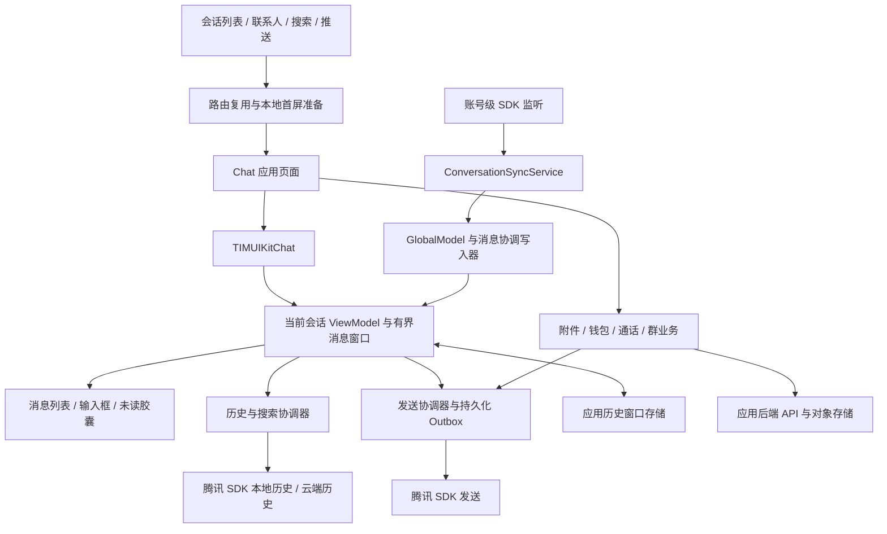
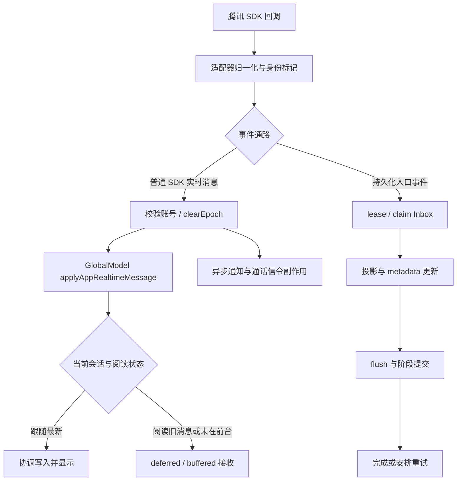
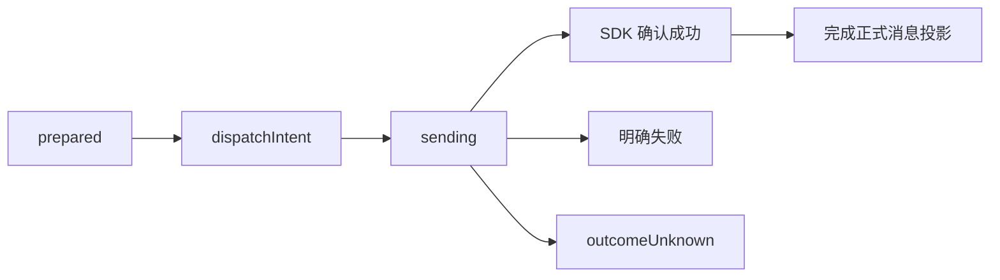

聊天对话页面全链路与分支分析

分析日期：2026-09-22。对象：当前 Flutter 工作区，GitNexus 登记仓库名为 `99chat`，对应目录 `99999999`。这是源码分析记录，不是测试通过报告，也不包含业务代码修改。

**1. 先建立整体认识**

这个聊天页的生产入口是 `lib/src/chat.dart` 的 `Chat`，核心消息界面由项目内定制的 `TIMUIKitChat` 承载。`pubspec.yaml` 使用本地 `third_party/tencent_cloud_chat_uikit` 和 `third_party/tencent_cloud_chat_sdk`；不能用上游 UIKit 的默认行为解释当前项目。

整体有四个相互协作、生命周期不同的部分：

| 部分 | 主要职责 | 关键边界 |
| --- | --- | --- |
| 应用页面与业务组件 | 导航、首屏准备、权限、资料、草稿、钱包、通话、群业务 | `Chat`、`chat_page`、应用 services |
| 定制 UIKit | 当前消息窗口、消息合并、分页、搜索定位、滚动、输入、气泡 | GlobalModel、SeparateViewModel、HistoryList |
| 账号级消息核心 | SDK 监听、发送持久化、事件协调、恢复、账号隔离 | ConversationSyncService、IM coordinators、MessageCoreStore |
| 外部服务 | 腾讯 IM 正文与消息操作；应用后端业务与附件；对象存储 | SDK adapter、ApiClient、附件签名传输 |

这个图表示主要职责关系，不能理解成每条消息都依次经过所有节点。普通 SDK 实时消息有快速投影通路；附件原生视频也有后端发送通路。[页面装配][s-chat-build]、[实时入口][s-ingress]、[发送协调器][s-send-coordinator]是三个最重要的阅读起点。

**2. 页面入口和导航分支**

主导航链路为：用户选择会话 → 规范化 C2C/group 会话身份 → 查询已存在路由 → 准备本地首屏 → 展示 `Chat` → UIKit 初始化 → 布局可用后继续补齐。

| 入口/条件 | 当前处理 | 要注意的分支 |
| --- | --- | --- |
| 手机会话列表点击 | 捕获进入时未读、预热本地窗口，调用 `openOrReuseAppChat` | 导航返回后再执行离页相关收尾 |
| 同一 Navigator 已打开相同会话，且无搜索目标 | 找到已有 route 并 `popUntil` 复用 | 返回已有 route 的 `popped` Future，不能立即假装离开聊天 |
| 携带 `initFindingMsg` 或 `searchJumpAnchor` | 进入指定消息定位流程，不按普通无锚点规则复用 | 目标可能不在当前最新窗口内 |
| 联系人、个人资料、群列表、共同群、加群成功等 | 汇入聊天路由或会话选择回调 | 新会话可能尚无 lastMessage |
| 新建群成功 | 部分入口直接用 `appChatRoute` 做 replace/removeUntil | 不能只搜索 `openOrReuseAppChat` 判断入口是否完整 |
| 推送、外部链接 | RouteHandler 解析后进入聊天 | 活跃会话、推送焦点与通知清理需要同步 |
| 桌面/宽屏 | 会话列表旁嵌入同一个 `Chat` | 切换会话可能走 `didUpdateWidget`，不一定产生新 Navigator route |

路由注册表使用 `group/c2c + normalized ID` 形成 session key，并按 Navigator 隔离。页面使用稳定 key、RepaintBoundary 等保持消息树。`prepareOpenViewport` 只对本地准备给短预算，云请求不应阻止页面进入；准备失败也不阻断导航。[路由注册与复用][s-route]、[会话点击][s-conversation-entry]、[宽屏装配][s-wide]。

源码还存在 `ChatV2`，当前生产入口检索没有发现它被调用；不能把演示实现、补丁备份目录与生产聊天链路合并描述。

**3. 状态归属、数据源和身份隔离**

聊天页最难的部分是多个异步任务同时更新同一会话。理解状态归属，比记住文件名更重要。

| 状态/数据 | 所有者与作用 | 不应误解为 |
| --- | --- | --- |
| 当前渲染消息 | SeparateViewModel + GlobalModel 的窗口投影 | 全部聊天历史 |
| 消息结构合并 | `MessageReconciliationWriter`，接收 delta，处理 adoption、去重、墓碑和身份约束 | 任意组件可直接替换 messageList |
| SDK 本地/云端正文 | 腾讯消息 service/adapter | 应用的 MessageCoreStore |
| `HistoryWindowStore` | 应用持久化窗口页、相邻页索引、变更、clearEpoch、deferred 状态 | 永久无限增长且已证明完整的历史档案 |
| `message_core.db` | inbox、writer lease、commit journal、outbox、恢复副本、读取/回执 outbox 等 | 所有普通正文都先写入这里 |
| 历史 coverage | 本地/云历史来源、覆盖范围和证明信息 | 仅按消息条数推断完整性 |
| 会话列表预览 | ConversationSyncService、ConversationLocalStore、ChatSessionController 等 | 当前聊天页 ViewModel |
| 页面临时状态 | ChatPageScope、ChatOpenLifecycle、header/topFix/draft 等窄控制器 | 账号消息服务的生命周期 |
| 上传/业务临时消息 | LocalMessageOverlayStore 与对应 task/order store | 已得到 SDK 确认的正式消息 |

`ChatSessionController` 这个名字容易引起混淆：它主要承担会话列表窗口和投影协调，并非独自管理聊天详情页的收发、滚动和历史。[会话投影控制器][s-session-controller]。

多层身份检查共同防止“上一账号/上一页的请求回来污染当前页面”：

- ownerUserId/accountGeneration：账号身份变化。
- domainGeneration/IM listener epoch：SDK 监听域变化或重新附着。
- conversation identity：群 ID、用户 ID、会话 ID 规范化后的目标。
- page/open generation：页面访问、切换会话、延后任务是否仍有效。
- clearEpoch：清空历史前的结果是否已经过期。
- history window generation/revision、request/cursor ID：替换窗口、搜索跳转、分页和恢复事务是否仍有效。

因此，仅判断 `mounted` 不足以保证一次异步结果可写入。页面仍 mounted 时，宽屏已可能换了会话，或者历史已被清空。启动时注册窗口仓库，认证恢复时配置 writer scope；页面退出只撤销页面作用域，账号级收消息仍继续。[启动注册][s-main]、[账号 scope][s-auth]、[页面 scope][s-page-scope]、[协调写入器][s-writer]。

**4. 打开会话：本地首屏、网络验证和延后业务**

`ChatOpenViewportCoordinator.prepareOpenViewport` 是首屏调度核心。其本地等待预算当前为 100ms，流程大致为：

1. 规范化会话身份，绑定 viewport collection，捕获本次打开身份。
2. 检查 recovery epoch、最新边界信任状态、会话预览是否领先于缓存。
3. 已有可信且足够的缓存窗口时直接复用。
4. 检查内存窗口；不足或 previewAhead 时，在预算内读取本地快照。
5. 锁定 initial snapshot，让页面先显示确定的首屏。
6. 需要修补时签发带账号/会话/open generation 的 ticket，后台执行 H0 修补。
7. 首帧之后执行 H2 云端验证与增量补齐；上翻操作可以优先于后台验证。

coverage 明确区分 `readyLocal / partialLocal / gapLocal / emptyLocal / emptyVerified / verified`。`emptyLocal` 只代表本地暂时没有数据，不证明会话从来没有消息；本地返回少于页大小，也不自动证明没有更旧消息。[首屏协调器][s-open]、[coverage 模型][s-viewport-models]、[预热服务][s-peek]。

最新窗口如果因恢复 epoch 已失效，代码会使旧最新缓存失效，并由指定 reset owner 执行重置。不能把旧的非空列表直接当作当前最新；搜索/阅读历史又需要自己的位置保护。

页面 `initState` 先种入本地资料、头像、未读基线、page scope、活动会话和 PushFocus，再绑定消息生命周期。`TIMUIKitChat` 显式设置 `localOnlyInitialOpen: true`。`didGetHistoricalMessageList` 标记 historyReady；首轮历史回调不承担重媒体下载。[页面初始化][s-chat-init]、[消息生命周期][s-chat-lifecycle]。

`ChatOpenLifecycle` 依次管理 created、historyReady、interactive、enriched、disposed。准备完成与布局完成是两道不同的门。`_schedulePostOpenTasks` 等待相应条件后分批启动：

| 后续任务 | 内容 | 为什么分开 |
| --- | --- | --- |
| 本地补齐 | 草稿、背景、群显示资料、IM 群 ID 解析 | 快速恢复用户上下文 |
| 消息补齐 | 云历史验证、可见媒体和头像信息 | 不让大块工作压住转场 |
| 群权限与资料 | 禁言、成员身份、群 metadata | 有独立缓存和请求代际 |
| 业务侧栏/浮层 | 游戏、返点、三公、直播等 | 不作为正文首屏依赖 |
| 空闲工作 | 钱包卡重试、音频/骰子准备、空历史修补 | 等交互窗口稳定后进行 |

所有这些任务都需要判断当前 generation，防止页面切换后的晚回调更新新会话。[延后任务调度][s-post-open]、[打开生命周期][s-open-lifecycle]。

**5. 收消息：普通实时通路与持久化事件通路**

腾讯高级消息适配器注册新消息、修改、撤回、已读回执、发送/下载进度等回调。事件先附带账号/域身份，经 `ConversationSyncService` 分派；不能简单画成“所有回调先落 Inbox 再上屏”。

`_handleMessageIngress` 对 SDK realtime namespace 直接转 `_handleSdkRealtimeMessage`，检查身份后调用全局模型。是否投影到当前页面取决于打开会话匹配；会话列表的 preview/unread 还会受 SDK conversation 回调驱动。[SDK 适配器][s-advanced-adapter]、[实时直达路径][s-realtime]。

其余持久化入口通过 writer lease 和 claim 建立写入权，推进 metadataCommitted、projectionPublished、completed 等阶段。失败安排重试，不把异常记录为已成功处理。[持久化入口][s-ingress]。

全局收消息内部还分流：

- `newMessageWillMount`：应用可做通话去重、媒体 metadata 和显示修正。
- typing/edit status：更新交互状态，不当成普通聊天气泡。
- 非当前前台窗口：记录 deferred 状态，避免强行改动用户正看的列表。
- 有持久化窗口仓库：先执行 bounded-history admission，协调窗口与 deferred 状态。
- 群乱序/seq gap：进入重排、缓冲和补洞；C2C 不能假设 seq 拥有群聊式连续语义。
- 常规入窗：合并、去重，必要时对密集回调合批通知 UI。
- 自己其他端发送/自己发送确认：结合已有本地 ID 做 adoption，避免重复气泡。

历史晚回、实时新消息、撤回、删除、发送确认最后需要服从同一套消息结构合并规则。`MessageDelta` 有 realtimeUpsert、optimisticInsert、adoption、edit、revoke、delete、readReceipt、localMetadata 等类型；保留墓碑和退休 local ID，防止旧结果复活已移除消息。[GlobalModel 收消息][s-global-receive]、[消息 delta][s-delta]。

**6. 发消息：乐观气泡、持久化发送和不确定结果**

文本发送的主链路是：输入提交 → `sendTextMessage` 建乐观占位 → SDK create message → 将 SDK 本地消息接入原气泡 → `_sendMessage` → 发送协调器 → SDK → 确认后更新原气泡和会话预览。

文本、@、回复、表情、自定义、语音、图片、视频、文件、位置、转发、合并转发、失败重发都有各自准备逻辑，普通 SDK 发送最终收敛到统一出口。附件后端分流另见后文。[文本入口][s-send-text]、[统一发送出口][s-send]。

`_sendMessage` 发送前检查目标和捕获的媒体 session；C2C 已确定不能发消息时拦截；群 ID 先规范化；已读回执参数根据会话类型调整。输入法 composing、@成员、回复态、草稿也各有保护，不是直接把文本框字符串发给 SDK。

发送协调器取得账号 lease，生成 operation/correlation 身份并持久化恢复信息。payload 进行加密保护；媒体恢复副本与正在使用的原文件分离。关键状态顺序为：

`dispatchIntent` 在 SDK 调用前写入。它标记操作已经可能对外发生：网络超时、进程中断不能据此断言发送失败。`outcomeUnknown` 会保留未决状态，不直接画成成功，也不随意转成可盲重发的失败。[协调器实现][s-send-coordinator]。

恢复服务只自动重新发送尚未跨过 dispatchIntent 的 prepared 操作。重启遇到 dispatchIntent/sending 会按结果不确定处理；恢复材料无效等情形进入人工处理分支。外部发送器在没有当前页面模型时，也使用全局的同类协调出口。[Outbox 恢复][s-outbox-recovery]。

成功回调还负责清除绑定会话的草稿、修补会话列表 lastMessage。自己发送的首条消息不能只等对方消息式的 onRecv 回调创建列表预览。媒体取消存在额外竞态：用户已经取消，但 SDK 随后成功时，需要执行对应撤回/删除收尾。

**7. 历史分页、搜索跳转与消息窗口**

历史调用统一进入 `getHistoryMessageListThroughIm06`：携带 writer scope、local/cloud 来源、latest/older/newer 方向、request generation、clearEpoch 等，交给历史/搜索协调器校验和排队，再进入 message service 和 SDK。[历史统一入口][s-history-entry]、[历史协调器][s-im06]、[SDK 历史服务][s-history-service]。

向更旧消息分页时，优先尝试 `HistoryWindowStore` 的相邻页：命中并且 scope 有效则提交；扫描到上限保留 continuation，不冒充 exhausted；不能满足请求才继续 SDK。SDK 游标必须来自真实消息，排除本地提示和 synthetic 消息，避免不断读取同一页。[分页执行器][s-pagination-load]。

| 情形 | 处理要点 |
| --- | --- |
| 云页为空 | 结合来源、边界与本地回退判断，不把任何空页都当终点 |
| 群消息有 seq 间隙 | 连续性校验，必要时补洞；不能只按条数宣布完整 |
| C2C 同一秒多条消息 | 不能仅靠秒级时间戳推进游标 |
| 请求失败 | 保留可重试状态，与 exhausted 分开 |
| 同锚点并发请求 | in-flight 去重，并检查旧请求是否仍拥有窗口 |
| 用户继续上翻 | 用户手势优先；不让自动补齐无限自触发 |
| 页面布局未好/正在裁剪 | UI gate 排队等待或丢弃过期意图 |
| 删除/撤回后历史返回 | 应用窗口 mutation/tombstone，防旧正文重新出现 |

分页 controller 的 olderAvailability 区分 unknown/available/exhausted，UI gate 区分 ready/wait/needsGesture/discard。当前失败提示开关不能直接等同于“页面会展示灰色失败条”。[分页状态机][s-pagination-controller]、[分页 UI gate][s-pagination-gate]。

窗口是有界的。当前策略值包括 target 220、softMax 280、paginationHighWater 260、historyReadSoftMax 300、两侧保留 40；SDK 历史页常量为 20，策略中的 loadBatch 40 不是所有请求的真实页大小。这些是当前策略，不是全局绝对消息条数保证。裁剪必须与可见锚点恢复一起执行。[窗口策略][s-window-policy]、[分页常量][s-history-constants]。

搜索结果/回复目标跳转不应从最新消息逐页扫到目标。`loadListForSpecificMessage` 会使旧窗口请求过期，解析 msgID/localID/seq/timestamp/sender/type 等锚点，尝试 findMessages；群 seq-only 目标有精确查找分支，再并行加载目标前后消息，合并并应用 mutation。SearchJumpStatus 区分 idle/loading/positioning/success/failed。[目标消息加载][s-specific-message]。

当前 `MessageArchiveHistoryService.register()` 显式执行 `ArchiveHistoryProvider.register(null)`，只注册清空同步。因此，Community 正文的生效读取来源是腾讯 SDK；类中保留的转换工具和旧归档字段，不代表仍走 HTTP 归档正文读取。[归档兼容层][s-archive]。

**8. 阅读旧消息、回到最新、未读与回执**

列表的“底部”只描述当前已加载窗口的几何位置。用户搜索到一条旧消息后，即使滚动位置到了这个窗口的底部，仍可能缺少大量更新的消息。代码因此区分以下状态：

| 状态 | 意义 |
| --- | --- |
| 几何上到达列表末端 | 只说明滚动位置 |
| latest window 包含真实最新边界 | 数据覆盖条件 |
| 最新正式消息确实完成渲染且可见 | UI 可见性条件 |
| 没有 missingNewer、buffered、unadmitted 消息 | 接收缓冲已被接入 |
| 当前 visit/restore operation/generation 匹配 | 事务仍属于本次访问 |
| durable confirmation 完成 | 对持久化未读状态的确认已成功 |

`_atTrueLatestEndNow` 联合判断多个条件。`scrollToLatestAndDismissUnreadCapsule` 是恢复事务：必要时先 reloadNewest，再等待布局、滚动、验证最新行、提交确认。当前代码最多进行 3 次补最新尝试，并设有 25 秒事务超时；用户拖动、换会话等会使尝试取消。不能用一次 `jumpTo(0)` 取代整条链路。[真正最新判断与跳转][s-tongue]。

阅读历史时，live window 会冻结当前阅读窗口；新消息可进入 buffered/deferred 状态。向最新方向移动时逐步接入，恢复跟随前需检查 visit、restoreOp、liveReceiveGeneration 等，防止新消息在恢复过程中再次改变最新边界。[实时窗口恢复][s-live-window]。

最新边界信任校验使用真实 SDK 返回的消息与会话预览比较。不能先把 preview 人工拼进列表，再用拼出的列表证明“已追上 preview”；synthetic 或未确认的本地发送也不能当云端覆盖证明。[最新窗口信任][s-latest-trust]。

未读至少分四件事：

1. 会话列表的未读数量：受 SDK conversation 更新、本地读取意图和 unread guard 影响。
2. 进入会话时的 entry unread：本次进入捕获的基线，可用于跳第一条未读。
3. 阅读历史期间新增的 unread/deferred：采用 visit 基线和窗口接入规则，不能随着 SQL ack 或每条气泡经过屏幕就随意递减胶囊。
4. 对方是否已读的 message receipt：是发送消息回执，和本机清掉会话红点不是同一操作。

`ConversationUnreadClearService` 管理 open fast path、读取意图持久化、SDK 更新、离页 finalizeOnce 和恢复；离页不得重复提交同一次收尾。旧 SDK unread 回调也不能立即把已处理的红点重新点亮。[会话未读协调][s-unread]。

消息级已读回执先去重，当前按约 300ms 合批，写 ReadReceiptOutbox 后再调用 SDK；成功确认、失败保留重试。会话级 markMessageAsRead 是另一条操作。消息是否为自己发送、会话类型和 needReadReceipt 等都会影响资格。[消息回执][s-read-receipts]。

**9. 输入、消息渲染和消息操作分支**

`Chat` 使用较窄的 Selector/Notifier 管理身份、主题、贴纸、header、topFix 和草稿；消息区保持稳定 key。`ChatStableOverlayStack` 保持父子结构稳定，增加群直播/游戏浮层不应导致列表整棵重挂。键盘避让由聊天组件协调，外层 Scaffold 当前设置 `resizeToAvoidBottomInset: false`。[页面构建][s-chat-build]。

| 消息或交互 | 主要分支 |
| --- | --- |
| 普通文本 | SDK 气泡；URL 链接处理；当前关闭 Markdown |
| 回复、@成员 | 输入态保存目标，选择成员后生成对应 SDK 消息；目标点击可触发锚点跳转 |
| 图片、视频、文件 | 普通 SDK 媒体或附件策略分流；点击预览、下载、打开/保存 |
| 语音 | 录制权限、发送、播放、停止；转文字有独立状态与结果持久化 |
| 表情、骰子、动态贴纸 | 本地稳定标识及定制 builder，避免重建时重启动画 |
| 群提示、好友建立、拒收提示 | 部分使用整行样式，不按普通左右气泡显示 |
| 钱包卡、红包领取提示 | 专用 custom renderer、订单状态补齐、稳定 key；领取提示可以是独立提示行 |
| 通话中间信令 | 部分不显示为消息行；最终通话结果去重后展示 |
| 上传中消息 | 上传任务卡；正式消息出现后按身份去掉重复 overlay |
| 未知/损坏 custom payload | 解析异常时保留正式消息兜底，不能把整个列表渲染打断 |

`messageListOverlayBuilder` 将正式消息与本地 overlay 合并，同时依据窗口是否包含最新/更旧边界决定投影。不能无条件把所有本地任务追加到一个搜索到的旧窗口。[消息 builder][s-message-builder]、[overlay 存储][s-overlays]。

长按/桌面菜单根据消息类型、状态、发送者、权限和配置选择操作，涵盖复制、回复、转发、多选、删除、撤回、翻译、语音转文字，以及桌面媒体的复制、另存、打开和目录定位。应用另加收藏、加入表情和特定群业务菜单。[消息菜单][s-message-menu]。

多选支持逐条转发、合并转发和删除，并有数量/消息类别限制；钱包卡等不支持的类型会阻止转发，而不是悄悄转发成普通文本。当前逐条转发相关数量限制为 30。[多选面板][s-multiselect]。

应用自定义菜单先关闭 tooltip，再通过 `Future.microtask` 调度业务回调。注释虽使用了“下一帧”措辞，实际机制是 microtask，不能把它理解为一定等到下一次渲染帧。菜单关闭、键盘、媒体预览和列表裁剪都可能改变几何尺寸，所以列表内有独立的锚点恢复与滚动事务。[应用菜单扩展][s-extra-menu]、[列表实现][s-history-list]。

更多面板组合了联系人名片、收藏内容、钱包入口和群直播入口；语音/视频通话先判断 C2C 与平台账号，再由实际启动器执行设备能力检查。[更多面板][s-more-panel]。

**10. 附件与媒体：三条不同路径**

路径一是普通 SDK 图片/视频/文件发送。路径二是应用后端上传，再通过 IM 发送附件引用。路径三是后端原生视频发送。选择取决于平台、文件是否有本地路径、附件策略、类型与大小；不是每张图和每个视频都走后端。

当前 IO 附件服务默认只支持 Android/iOS；Web 使用 stub，桌面不会因存在 IO 类就自动启用后端附件。未被附件服务接管的消息回到普通 SDK 发送路径。[附件分流入口][s-attachment-route]、[附件平台和任务服务][s-attachment-service]。

后端附件任务链路为：

`校验策略/大小 → 保存任务 → 文件 staging → 创建上传 → 分片签名 URL → 上传并 complete → 缩略图（需要时）→ 创建 reference → ready → 持久化 dispatching → 发送消息 → 记录结果`

| 结果/竞态 | 对应处理 |
| --- | --- |
| 上传或明确发送失败 | task 保留失败信息，UI 可按支持的策略重试 |
| 已交接给统一发送通路 | task 与外部发送结果共同完成，不直接生成第二条正式气泡 |
| 原生视频 POST 结果不确定 | 保存 outcomeUnknown，周期性 GET operation 状态；不再次盲目 POST |
| 账号切换/凭证代际变化 | owner/generation 校验使旧任务结果失效 |
| 正式 SDK 消息到达 | 关联 task/reference，移除已被正式消息表达的上传 overlay |
| 媒体预览结束或页面切换 | media session 和取消标记防止旧下载/发送回调污染当前会话 |

原生视频待确认任务当前每 15 秒做只读状态查询，并验证 clientOperationId、attachmentId、referenceId 与消息结果。成功后触发历史刷新。[附件任务状态机][s-attachment-service]。

应用可见的附件 API 边界包括 `/me/chat/attachment-policy`、`uploads`、分片 URL/complete、缩略图操作、`attachments/:id/references`、metadata/access，以及 `native-video-messages` 和 operation 状态。对象存储签名 URL 使用独立传输客户端，不能套用业务 API 的 JWT/device 拦截器。[附件 API][s-attachment-api]。

媒体预览还分手机路由与桌面预览载荷，返回时应保留阅读位置。进入媒体、钱包、选择器等临时路由，不等于真正结束聊天访问。

**11. C2C、群聊、平台账号及业务分支**

| 分支 | 聊天页内行为 | 后续边界 |
| --- | --- | --- |
| 普通 C2C | 好友/发送权限检查、资料、头像、已读、通话、转账等 | 用户资料、好友关系 API/SDK |
| C2C 权限 checking | `canMessage` 未决定，使用已有可信提示并后台补证 | 未知状态不自动等同于拒绝 |
| C2C 已确定 blocked | 显示拦截状态，阻止发送，并协调在途消息结果 | 好友/关系变化可使权限重新计算 |
| 平台官方/认证账号 | 按平台账号服务关闭部分输入、已读和头部设置/通话入口，使用定制文本显示 | 不同入口用到 verified/platform predicates，不能粗略并成所有普通 C2C |
| 普通群成员 | 群名称/人数、@成员、公告、群权限等 | GroupLocalStore、成员共享 store、SDK/后端资料 |
| 群禁言/个人禁言 | 输入替换为对应禁言态，实时事件后刷新 | 后端禁言状态与成员身份结合 |
| 群主/管理员 | 头像长按可出现禁言、移出等操作，撤回能力也有管理分支 | 权限检查与群操作服务 |
| 已退群/成员资格变化 | post-open 与实时事件重新验证资格，更新可操作状态 | 不能只沿用进入时缓存 |
| 群公告 | signature/revision、已关闭/已确认状态、转场后展示 | 防重复弹出；实时通知可触发刷新 |
| 群直播 | 从索引种入状态，current 查询/ETag、轮询、实时通知和浮层 | 页面退出停止页面轮询；直播内部另有生命周期 |
| 钱包/红包/订单 | 支付设置检查、业务 API 建单、卡片发送、状态更新、手工重试 | 业务订单状态与 IM 消息发送状态分离 |
| 游戏、返点、三公等 | 按群配置和角色显示 banner、菜单、报表、定庄、统计等 | 相关业务 API 与独立页面；不阻塞聊天正文初始化 |

群 ID 有应用业务 ID 与完整 IM ID 两种表达；Community 前缀等需要规范化，不能对已经完整的 ID 重复拼接。头像、群名称、昵称显示还有独立缓存与可见发送者刷新，不应通过整页 reload 解决所有资料变化。

钱包卡的可见状态需要本地即时反馈和后端订单真值共同推进。钱包卡禁止部分删除/撤回/转发操作；同一个订单重发、消息确认和状态更新必须分别处理，不能把订单支付成功当作 IM 已发送成功。[custom 消息显示][s-custom]、[权限/群操作入口][s-permissions]。

通话从页头或更多面板进入 `CallLauncher.startC2C`，检查设备支持、登录与麦克风/摄像头等，建立 outgoing pending session 并进入 LiveKit 通话页，再请求对应 API。当前启动器对 Web/桌面有限制；按钮层的 C2C 判断不等于设备必然支持。最终通话结果通过仓库/本地消息 overlay 接回聊天，并按 callId 等去重。[通话启动器][s-call]。

本次追到了这些业务从聊天页的入口、状态回流和 API/服务边界；支付账务、游戏结算、直播房间内部媒体状态机并未作为聊天正文链路做逐分支验证。

**12. 资料设置页、删除、撤回和清空**

页头进入资料/设置时，窄屏使用页面或弹层，宽屏偏向右侧栏；群成员轻量名片又是另一分支。C2C 设置连接搜索聊天内容、媒体文件、置顶、免打扰、背景、共同群、联系人编辑/删除、分享名片、发起通话、清空和投诉等。群设置连接群资料与成员管理。返回聊天需要更新受影响的资料/设置，不应一律重建当前消息窗口。[页头动作][s-header]、[C2C 设置][s-settings]。

消息删除、撤回、清空的生命周期不同：

| 操作 | 乐观处理与外部调用 | 失败/晚回处理 |
| --- | --- | --- |
| 删除一条消息 | 先记录 pending history mutation，再从当前投影移除，调用 SDK delete | 依据操作 token、窗口 revision 和 SDK 事实恢复，不能还原整份旧列表覆盖新消息 |
| 撤回自己的消息 | 写入撤回投影/墓碑，清媒体引用，调用 SDK revoke | 按作用域回滚或 settle mutation |
| 管理员撤回分支 | 当前代码有管理员修改消息 cloud marker 的路径 | 不应等同于所有场景都调用普通 revoke API |
| 清空会话历史 | 递增 clearEpoch，清窗口、coverage、调用记录与相关本地提示，并同步外部清空 | 清空前请求返回时因 epoch 失效而被拒绝 |

删除和撤回都针对钱包卡做特殊限制。删除成功后再处理相关未读退休；失败回滚需考虑用户已经切换窗口的情况。撤回也会影响媒体 gallery，不能只改气泡文本。[删除][s-delete]、[撤回][s-revoke]、[清空协调][s-clear]。

清空的后端兼容同步仍通过 `MessageArchiveHistoryService` 注册的 clearSync 处理；它还会对已归档会话重申归档标记。这不表示 HTTP 归档正文 reader 已重新启用。

**13. 页面覆盖、切换、断线恢复与退出**

| 事件 | 主要处理 | 关键区别 |
| --- | --- | --- |
| 打开媒体/钱包/选择器 | 临时让出焦点，保持聊天访问与锚点 | 不能自动按真正离页 finalize |
| 普通二级页面覆盖聊天 | routeVisible 改变；返回时按状态恢复 | deactivate 不等于 dispose |
| 前后台切换 | 尽早捕获输入控制器并保存草稿，恢复时协调历史/连接 | 不要求整个账号级收消息停止 |
| 断线或 foreground 回来 | recovery coordinator 结合 previewAhead、deferred、latest trust 与 epoch 判断 | 近期做过恢复不代表可以无条件跳过 |
| 宽屏换会话 | `didUpdateWidget` 重置旧会话局部状态、取消旧 post-open、建立新 scope/generation | 同一个 State 可能仍存在 |
| 真正 dispose | 撤销 page/viewport、取消订阅/计时器/轮询、保存草稿、停止音频、finalize 未读、释放活动会话 | 账号级消息服务继续运行 |

恢复协调有同会话互斥、优先级与 coalesce；当前有约 30 秒的部分恢复跳过窗口和约 2 秒前台合并窗口，但 previewAhead、存在 deferred、最新不可信、真实重连等会绕过普通跳过条件。用户正在读历史或搜索定位时，后台恢复不能抢走滚动位置。[恢复协调器][s-recovery]。

`dispose` 先使页面任务失效，再移除相关监听；草稿持久化与会话列表 flush 有先后关系。`ActiveChatRegistry`、PushFocus、通知抑制也需要及时释放，否则退出后消息可能继续被错误视为“当前正在看”。多选态的返回键先退出选择，和真正离开聊天不同。[页面退出][s-dispose]。

**14. 排查问题时按症状选入口**

下表是定位路径，不代表这些问题已经在运行中复现。

| 症状 | 优先核对的链路 |
| --- | --- |
| 首屏空白/旧消息闪一下后跳动 | prepareOpenViewport → coverage → initial snapshot → latest reset → layout gate |
| 会话列表最新消息比聊天里新 | previewAhead → raw SDK latest proof → H0/H2/foreground reconcile |
| 上翻到某处不继续/反复同一页 | UI gate → olderAvailability → cursor → window-store continuation → SDK 边界证据 |
| 搜索跳转被拉回底部 | search request generation → window replace → live-follow 冻结 → 后台恢复是否越界 |
| 新消息到了但当前列表不显示 | 是否正读历史 → deferred/admission → live receive generation → buffered reveal |
| 点未读胶囊不消失 | 是否缺 newer → 最新消息是否真实可见 → buffer/admission 是否为零 → durable confirmation |
| 一条发送出现两份 | optimistic local ID → SDK local ID adoption → operation/correlation → overlay 去重 |
| 发送后一直转圈 | Outbox 是否 outcomeUnknown；先区分结果未知与明确失败，不直接重发 |
| 删除/撤回后消息又出现 | pending mutation/tombstone → history late response → scoped rollback → clear/window generation |
| 清空后旧记录复活 | clearEpoch 是否贯穿请求、窗口页、coverage 和 realtime 投影 |
| 切账号后出现上一人的状态 | owner/accountGeneration/domainGeneration → lease → page/window scope |
| 群标题/人数/头像/禁言不同步 | 本地资料种入 → group/member store → 实时通知 → narrow controller |
| 打开菜单或预览后滚动抖动 | overlay 拓扑 → 几何冻结/锚点恢复 → keyboard/route restore |
| 离开后红点又回来/草稿丢失 | unread finalizeOnce/guard → SDK 晚回；draft capture → persist → conversation flush |
| 视频上传完成但对话里没有 | ready/dispatching → native POST 结果 → operation GET → history refresh → 正式消息关联 |

**15. 已有测试入口与本次验证边界**

仓库已经有较细的聊天相关测试。下面列的是有代表性的回归入口，不是本次执行结果：

| 主题 | 已有测试文件举例 |
| --- | --- |
| 路由与首屏 | `app_chat_route_session_reuse_test.dart`、`chat_preview_bootstrap_efficiency_test.dart`、`chat_initial_window_reveal_policy_test.dart`、`chat_history_open_layout_ready_test.dart` |
| 生命周期与最新信任 | `chat_lifecycle_generation_contract_test.dart`、`chat_latest_window_trust_test.dart`、`chat_latest_window_reset_service_test.dart` |
| 分页和裁剪 | `history_window_pagination_integration_test.dart`、`history_window_store_test.dart`、`history_window_trim_viewport_test.dart`、`community_older_gesture_recovery_test.dart` |
| 回最新与未读 | `history_durable_scroll_to_latest_test.dart`、`durable_unread_tongue_test.dart`、`bounded_history_global_test.dart`、`conversation_unread_after_leave_test.dart` |
| 发送持久化 | `im05_persistence_test.dart`、`im05_outbox_payload_cipher_test.dart`、`im08_external_sender_outbox_test.dart` |
| 历史/搜索统一出口 | `im06_history_production_wiring_test.dart`、`im06_history_search_coordinator_test.dart`、`im06_history_queue_order_test.dart`、`im06_search_production_wiring_test.dart` |
| 消息合并和变更 | `message_delta_contract_test.dart`、`message_reconciliation_writer_test.dart`、`chat_delete_revoke_optimistic_contract_test.dart` |
| 输入和媒体 | `chat_input_composition_guard_test.dart`、`chat_media_gallery_session_cancellation_test.dart`，以及 attachment/native video/upload projection 系列 |
| 架构约束 | `chat_architecture_closure_contract_test.dart` 检查页面层不直接结构写消息列表、历史/搜索出口和账号 scope 清理等 |

本次按 GitNexus 探索流程查询概念、符号和执行流，再对关键源码逐段确认。实际绑定的索引名是 `99chat`，不是 AGENTS 描述中的旧名字 `99999999`。检查时索引与 HEAD 的 commit 相同，但工作区有未提交变化；期间变化还在继续，因此本报告属于当天读取的工作区快照，不是固定提交的完整审计。

索引存在返回空引用、错配符号、执行流步骤缺失的问题。两次尝试 `analyze --index-only` 均在数据库文件占用阶段失败，未能宣布刷新成功。刷新日志还明确报告候选调用截断和未探索流程；所以图中缺失的分支不能视为代码不存在。相关记录见[索引刷新日志][s-index-log]。

本轮没有运行 Flutter 测试、真机操作、弱网/杀进程实验，也没有调用真实聊天/钱包/附件后端验证服务端行为。已分析到客户端 SDK/API 边界；后端内部实现、腾讯原生 SDK 内部、平台插件运行表现，以及外围业务完整内部状态机仍属于验证边界。报告中的状态约束是源码实现意图与当前路径说明，不是对线上无竞态的保证。

后续讨论这套聊天页面时，应同时给出会话类型、入口、平台、是否阅读历史/搜索定位、连接与页面生命周期，以及涉及的账号/窗口 generation；只说“消息列表刷新”往往不足以确定真正需要改动的层。

[s-route]: <C:/Users/ASUS/Downloads/Telegram Desktop/99999999/lib/src/navigation/app_chat_route.dart:254>
[s-conversation-entry]: <C:/Users/ASUS/Downloads/Telegram Desktop/99999999/lib/src/conversation.dart:3360>
[s-wide]: <C:/Users/ASUS/Downloads/Telegram Desktop/99999999/lib/src/pages/cross_platform/wide_screen/conversation_and_chat.dart:1129>
[s-chat-build]: <C:/Users/ASUS/Downloads/Telegram Desktop/99999999/lib/src/chat.dart:11066>
[s-ingress]: <C:/Users/ASUS/Downloads/Telegram Desktop/99999999/lib/src/services/conversation_local/conversation_sync_service.dart:1080>
[s-send-coordinator]: <C:/Users/ASUS/Downloads/Telegram Desktop/99999999/lib/src/services/im/outgoing_send_coordinator.dart:103>
[s-session-controller]: <C:/Users/ASUS/Downloads/Telegram Desktop/99999999/lib/src/chat_session/chat_session_controller.dart:44>
[s-main]: <C:/Users/ASUS/Downloads/Telegram Desktop/99999999/lib/main.dart:143>
[s-auth]: <C:/Users/ASUS/Downloads/Telegram Desktop/99999999/lib/src/services/auth_bootstrap_service.dart:146>
[s-page-scope]: <C:/Users/ASUS/Downloads/Telegram Desktop/99999999/lib/src/chat_page/chat_page_scope.dart:1>
[s-writer]: <C:/Users/ASUS/Downloads/Telegram Desktop/99999999/third_party/tencent_cloud_chat_uikit/lib/business_logic/view_models/message_reconciliation_writer.dart:118>
[s-open]: <C:/Users/ASUS/Downloads/Telegram Desktop/99999999/lib/src/services/chat_open_viewport_coordinator.dart:350>
[s-viewport-models]: <C:/Users/ASUS/Downloads/Telegram Desktop/99999999/lib/src/services/chat_viewport/chat_viewport_models.dart:4>
[s-peek]: <C:/Users/ASUS/Downloads/Telegram Desktop/99999999/lib/src/services/chat_history_peek_bootstrap.dart:203>
[s-chat-init]: <C:/Users/ASUS/Downloads/Telegram Desktop/99999999/lib/src/chat.dart:9142>
[s-chat-lifecycle]: <C:/Users/ASUS/Downloads/Telegram Desktop/99999999/lib/src/chat.dart:9382>
[s-post-open]: <C:/Users/ASUS/Downloads/Telegram Desktop/99999999/lib/src/chat.dart:8178>
[s-open-lifecycle]: <C:/Users/ASUS/Downloads/Telegram Desktop/99999999/lib/src/chat_page/chat_open_lifecycle.dart:1>
[s-advanced-adapter]: <C:/Users/ASUS/Downloads/Telegram Desktop/99999999/lib/src/services/im/tencent_advanced_message_adapter.dart:238>
[s-realtime]: <C:/Users/ASUS/Downloads/Telegram Desktop/99999999/lib/src/services/conversation_local/conversation_sync_service.dart:1215>
[s-global-receive]: <C:/Users/ASUS/Downloads/Telegram Desktop/99999999/third_party/tencent_cloud_chat_uikit/lib/business_logic/view_models/tui_chat_global_model.dart:9168>
[s-delta]: <C:/Users/ASUS/Downloads/Telegram Desktop/99999999/third_party/tencent_cloud_chat_uikit/lib/business_logic/view_models/message_delta.dart:8>
[s-send-text]: <C:/Users/ASUS/Downloads/Telegram Desktop/99999999/third_party/tencent_cloud_chat_uikit/lib/business_logic/separate_models/tui_chat_separate_view_model.dart:7509>
[s-send]: <C:/Users/ASUS/Downloads/Telegram Desktop/99999999/third_party/tencent_cloud_chat_uikit/lib/business_logic/separate_models/tui_chat_separate_view_model.dart:5374>
[s-outbox-recovery]: <C:/Users/ASUS/Downloads/Telegram Desktop/99999999/lib/src/services/im/outgoing_outbox_recovery_service.dart:24>
[s-history-entry]: <C:/Users/ASUS/Downloads/Telegram Desktop/99999999/third_party/tencent_cloud_chat_uikit/lib/business_logic/view_models/tui_chat_global_model.dart:601>
[s-im06]: <C:/Users/ASUS/Downloads/Telegram Desktop/99999999/lib/src/services/im/history_search_coordinator.dart:964>
[s-history-service]: <C:/Users/ASUS/Downloads/Telegram Desktop/99999999/third_party/tencent_cloud_chat_uikit/lib/data_services/message/message_service_implement.dart:524>
[s-pagination-load]: <C:/Users/ASUS/Downloads/Telegram Desktop/99999999/third_party/tencent_cloud_chat_uikit/lib/business_logic/separate_models/tui_chat_history_pagination_load.dart:235>
[s-pagination-controller]: <C:/Users/ASUS/Downloads/Telegram Desktop/99999999/third_party/tencent_cloud_chat_uikit/lib/business_logic/controllers/history_pagination_controller.dart:19>
[s-pagination-gate]: <C:/Users/ASUS/Downloads/Telegram Desktop/99999999/third_party/tencent_cloud_chat_uikit/lib/ui/controllers/chat_list_pagination_ui_gate.dart:1>
[s-window-policy]: <C:/Users/ASUS/Downloads/Telegram Desktop/99999999/third_party/tencent_cloud_chat_uikit/lib/business_logic/view_models/chat_message_window_policy.dart:4>
[s-history-constants]: <C:/Users/ASUS/Downloads/Telegram Desktop/99999999/third_party/tencent_cloud_chat_uikit/lib/ui/constants/history_message_constant.dart:1>
[s-specific-message]: <C:/Users/ASUS/Downloads/Telegram Desktop/99999999/third_party/tencent_cloud_chat_uikit/lib/business_logic/separate_models/tui_chat_separate_view_model.dart:1131>
[s-archive]: <C:/Users/ASUS/Downloads/Telegram Desktop/99999999/lib/src/services/message_archive_history_service.dart:57>
[s-tongue]: <C:/Users/ASUS/Downloads/Telegram Desktop/99999999/third_party/tencent_cloud_chat_uikit/lib/ui/views/TIMUIKitChat/TIMUIKItMessageList/TIMUIKitTongue/tim_uikit_chat_history_message_list_tongue_container.dart:203>
[s-live-window]: <C:/Users/ASUS/Downloads/Telegram Desktop/99999999/third_party/tencent_cloud_chat_uikit/lib/business_logic/separate_models/tui_chat_history_live_window.dart:219>
[s-latest-trust]: <C:/Users/ASUS/Downloads/Telegram Desktop/99999999/lib/src/services/chat_latest_window_trust.dart:72>
[s-unread]: <C:/Users/ASUS/Downloads/Telegram Desktop/99999999/lib/src/services/conversation_unread_clear_service.dart:496>
[s-read-receipts]: <C:/Users/ASUS/Downloads/Telegram Desktop/99999999/third_party/tencent_cloud_chat_uikit/lib/business_logic/separate_models/tui_chat_separate_view_model.dart:3611>
[s-message-builder]: <C:/Users/ASUS/Downloads/Telegram Desktop/99999999/lib/src/chat.dart:2684>
[s-overlays]: <C:/Users/ASUS/Downloads/Telegram Desktop/99999999/lib/src/services/local_message_overlay_store.dart:1>
[s-message-menu]: <C:/Users/ASUS/Downloads/Telegram Desktop/99999999/third_party/tencent_cloud_chat_uikit/lib/ui/views/TIMUIKitChat/TIMUIKItMessageList/tim_uikit_chat_message_tooltip.dart:732>
[s-multiselect]: <C:/Users/ASUS/Downloads/Telegram Desktop/99999999/third_party/tencent_cloud_chat_uikit/lib/ui/views/TIMUIKitChat/tim_uikit_multi_select_panel.dart:87>
[s-extra-menu]: <C:/Users/ASUS/Downloads/Telegram Desktop/99999999/lib/src/chat.dart:3481>
[s-history-list]: <C:/Users/ASUS/Downloads/Telegram Desktop/99999999/third_party/tencent_cloud_chat_uikit/lib/ui/views/TIMUIKitChat/TIMUIKItMessageList/tim_uikit_chat_history_message_list.dart:3027>
[s-more-panel]: <C:/Users/ASUS/Downloads/Telegram Desktop/99999999/lib/src/chat.dart:3717>
[s-attachment-route]: <C:/Users/ASUS/Downloads/Telegram Desktop/99999999/third_party/tencent_cloud_chat_uikit/lib/business_logic/separate_models/tui_chat_separate_view_model.dart:6599>
[s-attachment-service]: <C:/Users/ASUS/Downloads/Telegram Desktop/99999999/lib/src/services/chat_attachment_service_io.dart:311>
[s-attachment-api]: <C:/Users/ASUS/Downloads/Telegram Desktop/99999999/lib/src/api/chat_attachment_api.dart:1>
[s-custom]: <C:/Users/ASUS/Downloads/Telegram Desktop/99999999/lib/utils/custom_message/custom_message_element.dart:1>
[s-permissions]: <C:/Users/ASUS/Downloads/Telegram Desktop/99999999/lib/src/chat.dart:1525>
[s-call]: <C:/Users/ASUS/Downloads/Telegram Desktop/99999999/lib/src/services/call_launcher.dart:109>
[s-header]: <C:/Users/ASUS/Downloads/Telegram Desktop/99999999/lib/src/chat.dart:7027>
[s-settings]: <C:/Users/ASUS/Downloads/Telegram Desktop/99999999/lib/src/pages/c2c_chat_settings_page.dart:432>
[s-delete]: <C:/Users/ASUS/Downloads/Telegram Desktop/99999999/third_party/tencent_cloud_chat_uikit/lib/business_logic/separate_models/tui_chat_separate_view_model.dart:7650>
[s-revoke]: <C:/Users/ASUS/Downloads/Telegram Desktop/99999999/third_party/tencent_cloud_chat_uikit/lib/business_logic/separate_models/tui_chat_separate_view_model.dart:7928>
[s-clear]: <C:/Users/ASUS/Downloads/Telegram Desktop/99999999/lib/src/services/conversation_history_clear_service.dart:25>
[s-recovery]: <C:/Users/ASUS/Downloads/Telegram Desktop/99999999/lib/src/services/chat_history_recovery_coordinator.dart:9>
[s-dispose]: <C:/Users/ASUS/Downloads/Telegram Desktop/99999999/lib/src/chat.dart:9724>
[s-index-log]: <C:/Users/ASUS/Downloads/Telegram Desktop/99999999/artifacts/chat-full-chain-2026-09-22/gitnexus-refresh.log:1>
