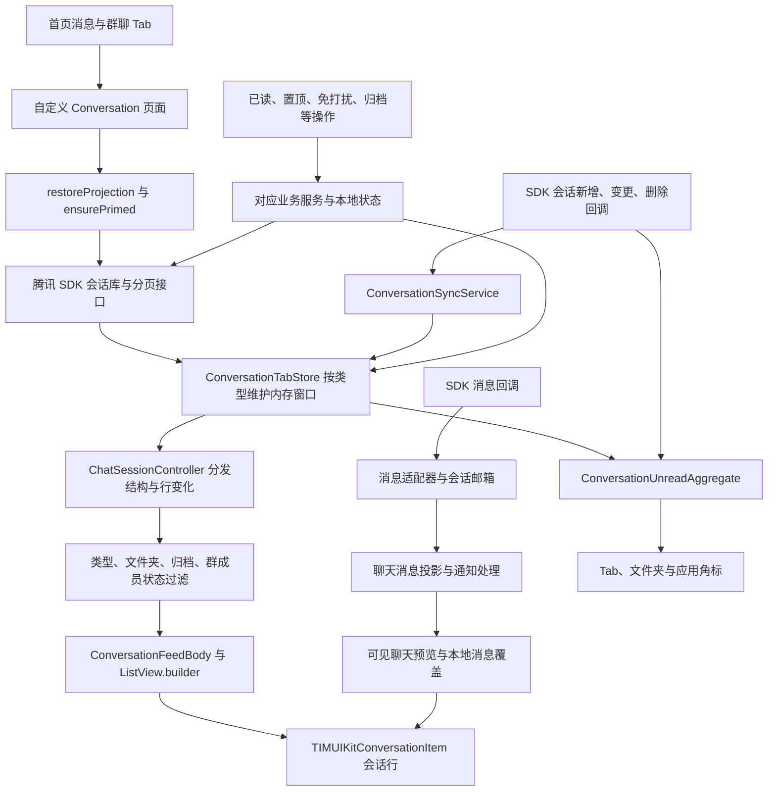

消息会话列表全链路分析

分析基线：分支 fix/muted-member-profile-recovery，提交 c5008765a84faf765b8f6b47bd7c878980ad71e7。分析日期：2026-09-22。GitNexus 仓库绑定为 99chat，已核对其路径就是当前工作区，并更新图索引到此提交。

本次为源码与调用图分析，没有修改产品代码，没有运行 App 或重新执行测试。文中“当前行为”指代码实现；现有测试只作为预期行为的依据。GitNexus 的关键词全文索引修复仍有 File.file_fts 错误，部分动态调用关系也不完整，因此关键结论已回到具体实现核对，不能把空调用图当成“没有调用”。

最重要的结论是：当前主列表采用 SDK 会话库作为会话数据来源。SDK 数据进入按单聊、群聊分开的 ConversationTabStore 内存集合，再经过 ChatSessionController 的变更通知、页面过滤和 Feed 渲染，最终成为屏幕上的会话行。应用自己的 ConversationLocalStore SQLite 仍承担业务状态与兼容路径，但不再为主列表首屏提供完整会话快照，也不保存每一页 SDK 会话的镜像。

1. 页面入口与对象职责

首页为消息和群聊分别缓存 Conversation 页面，通过 listScope 区分单聊、群聊，切换 Tab 会复用页面实例。入口见 [HomePage 的页面创建](<C:/Users/ASUS/Downloads/Telegram Desktop/99999999/lib/src/pages/home_page.dart:527>)。真正的主页面是项目自定义的 [Conversation](<C:/Users/ASUS/Downloads/Telegram Desktop/99999999/lib/src/conversation.dart:543>)，它复用了 SDK UI 的单行组件，而非直接使用 SDK 提供的整页会话列表。

| 层 | 主要对象 | 实际职责 |
| --- | --- | --- |
| 页面与交互 | Conversation | 选择范围、文件夹、滚动、点击、菜单、进入聊天和返回 |
| 按类型的数据集合 | ConversationTabStore | 单聊/群聊分页、游标、合并、排序、窗口裁剪、单行视图通知 |
| 页面通知桥接 | ChatSessionController | 结构变化与行内容变化分流、合并通知、首屏恢复入口、离开聊天后的补丁 |
| SDK 连接与同步 | ConversationSyncService | SDK 监听、初始化协调、实时回调、会话与消息分路、本地业务提交 |
| 列表渲染 | ConversationFeedBody | 列表模型缓存、虚拟化、稳定行标识、隐藏页暂停工作 |
| 展示组件 | TIMUIKitConversationItem | 名称、头像、摘要、时间、未读、免打扰、置顶、在线状态 |
| 未读汇总 | ConversationUnreadAggregate | 单聊/群聊汇总、SDK 总未读、文件夹原始未读、增量版本保护 |
| 本地业务状态 | ConversationLocalStore 等 | 业务提交、草稿与读取锚点等状态，以及部分旧流程兼容 |

[ChatSessionController.conversations](<C:/Users/ASUS/Downloads/Telegram Desktop/99999999/lib/src/chat_session/chat_session_controller.dart:247>) 最终返回 TabStore 的集合，不是另一套互相竞争的列表数据源。[TabStore 的数据源说明](<C:/Users/ASUS/Downloads/Telegram Desktop/99999999/lib/src/services/conversation_local/conversation_tab_store.dart:38>) 与 [SDK 分页结束处理](<C:/Users/ASUS/Downloads/Telegram Desktop/99999999/lib/src/services/conversation_local/conversation_tab_store.dart:2799>) 明确了 SDK 主数据源和“不把 SDK 页写回应用 SQLite”的实现。

2. 首次进入：先准备可见 Tab，再协调其余启动工作

页面 initState 注册列表、归档、文件夹、资料变化、同步状态、群成员状态等监听，然后启动可见范围恢复。[初始化入口](<C:/Users/ASUS/Downloads/Telegram Desktop/99999999/lib/src/conversation.dart:1140>)

_restoreSdkConversationFirstWindow 会捕获当前账号会话身份、等待首页首帧，再调用 restoreProjection，并对首次分页做短暂抑制。[页面首屏恢复](<C:/Users/ASUS/Downloads/Telegram Desktop/99999999/lib/src/conversation.dart:1681>)

restoreProjection 名称虽然保留了“恢复投影”的含义，当前实现明确不从应用 SQLite 填充首屏；它先确保归档信息可用，再通过 _primeSdkWindowDirect → TabStore.ensurePrimed 获取 SDK 首页。[首屏恢复实现](<C:/Users/ASUS/Downloads/Telegram Desktop/99999999/lib/src/chat_session/chat_session_controller.dart:514>)、[直接准备 SDK 窗口](<C:/Users/ASUS/Downloads/Telegram Desktop/99999999/lib/src/chat_session/chat_session_controller.dart:1193>)

HomeBootstrap 和 HomePostImSyncService 也会参与首屏与连接准备，因此同一类型的初始化存在多个调用入口。ensurePrimed 对每个类型共享进行中的请求，避免页面挂载、首页启动和同步回调重复清空或重复请求同一页。[首页启动协调](<C:/Users/ASUS/Downloads/Telegram Desktop/99999999/lib/src/bootstrap/home_bootstrap.dart:120>)、[首次请求合并](<C:/Users/ASUS/Downloads/Telegram Desktop/99999999/lib/src/services/conversation_local/conversation_tab_store.dart:885>)

第一页大小存在两个配置：TabStore 默认 50，typed bootstrap 的冷启动请求使用 30。哪条入口先发起同一类型的请求，就决定本次共享请求使用的大小，不能简单认定“每次启动固定 30 条”。[分页常量](<C:/Users/ASUS/Downloads/Telegram Desktop/99999999/lib/src/services/conversation_local/conversation_tab_store.dart:317>)、[按类型启动](<C:/Users/ASUS/Downloads/Telegram Desktop/99999999/lib/src/services/conversation_local/conversation_sync_service.dart:3571>)

网络/同步状态由 ConversationListSyncNotifier 独立维护。列表已有数据与 SDK 同步是否完成是两件事，收到首批 SDK 数据后可以先显示，再更新同步状态。[同步状态对象](<C:/Users/ASUS/Downloads/Telegram Desktop/99999999/lib/src/services/conversation_local/conversation_list_sync_notifier.dart:47>)

3. SDK 数据从哪里来，链路能追到哪一层

TabStore._fetch 调用 getConversationListByFilter，携带 conversationType、nextSeq、count，单聊和群聊分别分页。[SDK 分页调用](<C:/Users/ASUS/Downloads/Telegram Desktop/99999999/lib/src/services/conversation_local/conversation_tab_store.dart:2846>)

项目使用仓库内 third_party/tencent_cloud_chat_sdk 覆盖包依赖。Dart 管理器根据平台分流：Web 走平台实现，原生平台走 TIMConversationManager；原生适配器最终进入 DartGetConversationListByFilter FFI 接口。[Dart 会话管理器](<C:/Users/ASUS/Downloads/Telegram Desktop/99999999/third_party/tencent_cloud_chat_sdk/lib/manager/v2_tim_conversation_manager.dart:156>)、[原生 FFI 适配](<C:/Users/ASUS/Downloads/Telegram Desktop/99999999/third_party/tencent_cloud_chat_sdk/lib/native_im/adapter/tim_conversation_manager.dart:257>)

因此这里能确认“应用 → SDK Dart 层 → 原生 SDK 接口”的路径。腾讯原生 SDK 内部如何调度本地数据库与云同步，不在本仓库 Dart 代码可验证范围内。应用自己的归档、文件夹等业务服务还有独立持久化/云同步路径，不能与 SDK 会话分页混为同一个后端接口。

4. 收到新消息：会话回调与消息回调分开处理

会话回调负责会话列表的主要数据更新：
SDK onNewConversation/onConversationChanged → ConversationSyncService → ChatSessionController.applyPendingRealtimeProjection → 未读汇总与 TabStore.applyPatches。删除回调走单独移除路径，总未读回调更新 SDK 总未读。[SDK 会话监听器](<C:/Users/ASUS/Downloads/Telegram Desktop/99999999/lib/src/services/conversation_local/conversation_sync_service.dart:750>)、[实时会话补丁入口](<C:/Users/ASUS/Downloads/Telegram Desktop/99999999/lib/src/chat_session/chat_session_controller.dart:804>)

消息回调负责聊天消息与通知处理：
TencentAdvancedMessageAdapter → 按会话组织的消息处理队列 → 当前 SDK 实时分支 → TUIChatGlobalModel.applyAppRealtimeMessage。只有匹配当前打开的会话才投影到其聊天消息列表，通知等副作用另行处理。[消息适配器](<C:/Users/ASUS/Downloads/Telegram Desktop/99999999/lib/src/services/conversation_local/conversation_sync_service.dart:860>)、[SDK 实时消息分支](<C:/Users/ASUS/Downloads/Telegram Desktop/99999999/lib/src/services/conversation_local/conversation_sync_service.dart:1215>)

这不表示消息通道完全不能影响列表摘要。列表行还会在 SDK lastMessage 基础上合并当前聊天的可见预览和本地消息覆盖，以支持及时显示、删除或撤回等场景；会话排序、未读等核心会话状态仍由对应会话数据路径管理。

首次分页请求进行中收到实时回调，TabStore 会记录本次请求期间的修改，合并分页结果时保留较新的实时数据。未读也携带请求开始时的版本，避免晚到的旧页把已读重新变成未读。[分页期间变更与版本捕获](<C:/Users/ASUS/Downloads/Telegram Desktop/99999999/lib/src/services/conversation_local/conversation_tab_store.dart:2608>)、[未读页版本保护](<C:/Users/ASUS/Downloads/Telegram Desktop/99999999/lib/src/services/conversation_local/conversation_unread_aggregate.dart:165>)

5. 从内存数据到屏幕：过滤、排序、行更新

页面先按当前范围构建可见会话集合，处理类型、文件夹、归档、特殊账号、自聊、隐藏官方会话以及已移除群等条件。文件夹需要展示窗口之外的会话时，会另行补齐；与当前 SDK 源重叠时使用当前源中的行。[可见会话构建](<C:/Users/ASUS/Downloads/Telegram Desktop/99999999/lib/src/conversation.dart:3918>)

普通会话列表遵循 Store 已确定的顺序，不在每次 build 中重新排序。排序比较器主要依次看：置顶、活跃时间、orderkey、会话 ID；草稿时间可成为活跃时间。比较函数虽然位于 ConversationLocalStore 文件中，但这里复用的是排序规则，不代表列表改回 SQLite 驱动。[活跃时间计算](<C:/Users/ASUS/Downloads/Telegram Desktop/99999999/lib/src/services/conversation_local/conversation_local_store.dart:2950>)、[排序规则](<C:/Users/ASUS/Downloads/Telegram Desktop/99999999/lib/src/services/conversation_local/conversation_local_store.dart:9230>)

归档入口、群通知入口是 Feed 的特殊行，与普通会话行一起组装。[Feed 行模型组装](<C:/Users/ASUS/Downloads/Telegram Desktop/99999999/lib/src/widgets/conversation_feed/conversation_feed_rows.dart:231>)

ChatSessionController 把变化拆成列表结构变化和单行内容变化；结构变化推动 feedRevision，内容变化尽量只推动受影响行的 revision。[差量通知](<C:/Users/ASUS/Downloads/Telegram Desktop/99999999/lib/src/chat_session/chat_session_controller.dart:194>)。页面中的会话行监听行 revision、TabStore 行视图和预览 revision，再按会话 ID 取得最新行。[单行绑定](<C:/Users/ASUS/Downloads/Telegram Desktop/99999999/lib/src/conversation.dart:4899>)

ConversationFeedBody 使用 ListView.builder、固定行高度、稳定 Key 和 findChildIndexCallback，尽量保留重排后的行状态。隐藏 Tab 或被聊天路由覆盖的页面可以复用树并停止额外工作；恢复可见时再读取当前数据。[可见性开关](<C:/Users/ASUS/Downloads/Telegram Desktop/99999999/lib/src/widgets/conversation_feed/conversation_feed_body.dart:104>)、[Feed 构建](<C:/Users/ASUS/Downloads/Telegram Desktop/99999999/lib/src/widgets/conversation_feed/conversation_feed_body.dart:590>)、[ListView 与行定位](<C:/Users/ASUS/Downloads/Telegram Desktop/99999999/lib/src/widgets/conversation_feed/conversation_feed_body.dart:974>)

SDK 实时变更通知采用有界的合并窗口，当前配置约 48 ms；不是每收到一条消息就重建整页。滚动期间排序可以冻结，停止滚动后重排发生变化的类型，再刷新列表。[冻结与恢复排序](<C:/Users/ASUS/Downloads/Telegram Desktop/99999999/lib/src/services/conversation_local/conversation_tab_store.dart:603>)、[合并通知调度](<C:/Users/ASUS/Downloads/Telegram Desktop/99999999/lib/src/chat_session/chat_session_controller.dart:1957>)、[滚动停止处理](<C:/Users/ASUS/Downloads/Telegram Desktop/99999999/lib/src/conversation.dart:2149>)

6. 会话行展示的数据并非全部直接读取一个 SDK 对象

| 展示内容 | 当前来源与处理 |
| --- | --- |
| 名称 | SDK 会话资料结合好友备注、本地资料、显示名缓存；群名通过 GroupDisplayResolver 与本地群资料解析 |
| 头像与在线状态 | 页面解析头像和状态后传入行组件，资料变化可单独驱动行刷新 |
| 摘要 | SDK lastMessage 与聊天可见预览、本地消息覆盖合并，再交给摘要渲染器 |
| 草稿 | 会话 draftText/draftTimestamp 传给行组件，同时参与活跃时间 |
| 未读 | 当前会话对象的 unreadCount，免打扰图标独立计算 |
| 置顶、提醒、时间 | 使用会话状态及解析后的预览时间，群提醒列表单独传入 |

名称入口见 [页面名称解析](<C:/Users/ASUS/Downloads/Telegram Desktop/99999999/lib/src/conversation.dart:5020>)、[FriendDisplayName](<C:/Users/ASUS/Downloads/Telegram Desktop/99999999/lib/utils/friend_display_name.dart:227>)。摘要入口见 [页面预览缓存](<C:/Users/ASUS/Downloads/Telegram Desktop/99999999/lib/src/conversation.dart:718>)、[预览合并](<C:/Users/ASUS/Downloads/Telegram Desktop/99999999/lib/src/utils/conversation_preview_history_sync.dart:308>)。最终传入组件的字段见 [TIMUIKitConversationItem](<C:/Users/ASUS/Downloads/Telegram Desktop/99999999/lib/src/conversation.dart:5252>)。

摘要合并并不是永远用聊天页最后一条覆盖 SDK lastMessage，而是通过 ConversationLastMessagePrefer 判断更合适的最后消息，防止旧聊天窗口把更新的 SDK 摘要退回去。预览解析还使用缓存和分帧队列，因此“会话数据已更新”“解析后的预览已更新”“屏幕已绘制”是不同阶段。[预览分帧处理](<C:/Users/ASUS/Downloads/Telegram Desktop/99999999/lib/src/conversation.dart:772>)

7. 滚动分页与大列表窗口

当前主会话列表关闭下拉刷新。向下滚动接近末端时触发更多会话分页；向上返回被裁剪区域时恢复前缀数据。这与聊天页“向顶部加载历史消息”是两个不同的功能。[滚动入口](<C:/Users/ASUS/Downloads/Telegram Desktop/99999999/lib/src/conversation.dart:2051>)、[主 Feed 禁用下拉刷新](<C:/Users/ASUS/Downloads/Telegram Desktop/99999999/lib/src/widgets/conversation_feed/conversation_feed_body.dart:604>)

_loadMoreFeedConversations 对请求合并，保存视口锚点，按当前类型分页，再尽量恢复锚点。没有增长会暂时抑制继续请求，避免同一位置持续空转。[页面加载更多](<C:/Users/ASUS/Downloads/Telegram Desktop/99999999/lib/src/conversation.dart:2761>)

loadMoreForViewport 先恢复窗口尾部保留的会话引用，必要时再取 SDK 后续页。遇到整页被归档/成员关系过滤或重复内容，可在一次请求中继续尝试，最多 3 页。不能因为过滤后为空就判断“到底了”；结束状态取决于 SDK isFinished 或无法继续前进的游标。网络失败保留游标，之后可重试。[视口分页](<C:/Users/ASUS/Downloads/Telegram Desktop/99999999/lib/src/services/conversation_local/conversation_tab_store.dart:989>)、[分页完成判定](<C:/Users/ASUS/Downloads/Telegram Desktop/99999999/lib/src/services/conversation_local/conversation_tab_store.dart:2799>)

当前开启滑动窗口，每种类型主要保留约 600 条会话，裁剪部分保留会话 ID 以便恢复。这是内存会话窗口管理，不是删除会话或删除聊天历史。[窗口配置](<C:/Users/ASUS/Downloads/Telegram Desktop/99999999/lib/src/services/conversation_local/conversation_perf_flags.dart:131>)、[恢复窗口前缀](<C:/Users/ASUS/Downloads/Telegram Desktop/99999999/lib/src/services/conversation_local/conversation_tab_store.dart:1018>)

8. 未读至少有四种展示口径

| 位置 | 口径 | 排查含义 |
| --- | --- | --- |
| 单条会话 | conversation.unreadCount | 先看对应会话对象及本地清零是否正确 |
| 消息/群聊 Tab | 可通知未读汇总；排除免打扰、归档、隐藏项等；群聊还可能加群通知 | 不能简单把屏幕所有行的数字相加 |
| 文件夹 | 按文件夹中的会话使用原始 SDK 未读计数，包括免打扰/归档会话 | 不能用 Tab 的“可通知数”代替文件夹原始数 |
| 应用图标角标 | 优先 SDK 总未读；未取得时回退消息与群聊汇总；再加好友申请 | 不保证总是等于消息 Tab 加群聊 Tab |

对应代码：[未读聚合](<C:/Users/ASUS/Downloads/Telegram Desktop/99999999/lib/src/services/conversation_local/conversation_unread_aggregate.dart:77>)、[免打扰与排除规则](<C:/Users/ASUS/Downloads/Telegram Desktop/99999999/lib/src/utils/conversation_unread_utils.dart:13>)、[应用与 Tab 角标](<C:/Users/ASUS/Downloads/Telegram Desktop/99999999/lib/src/utils/app_badge_unread_utils.dart:11>)。

未读总量不能只统计当前已加载的 30/50/600 条会话。因此聚合器还有独立 SDK 未读会话扫描：原生按“有未读”过滤分页，Web 使用对应回退接口；把扫描结果与扫描期间更晚的增量变更合并。[窗口外未读获取](<C:/Users/ASUS/Downloads/Telegram Desktop/99999999/lib/src/services/conversation_local/conversation_unread_aggregate.dart:218>)

免打扰和归档改变的是某些汇总的“是否计入”，不等于把原始会话未读清零。已读、删除及晚到分页之间使用版本保护，避免计数复活。[业务状态改变后的汇总](<C:/Users/ASUS/Downloads/Telegram Desktop/99999999/lib/src/services/conversation_local/conversation_unread_aggregate.dart:420>)

9. 点击进入聊天，再返回列表

点击会话先保存进入时的未读数量，快速清理本地未读，再选择当前会话。聊天视口准备可异步执行，不要求先等 SDK 或应用数据库工作全部结束才导航。桌面布局使用嵌入式聊天切换，移动端走聊天路由。[点击会话完整入口](<C:/Users/ASUS/Downloads/Telegram Desktop/99999999/lib/src/conversation.dart:3304>)

clearLocalForOpenFast 会先更新本地 UI、读取锚点和聊天会话状态，再异步提交本地业务状态；需要通知 SDK 时，持久化已读意图到 outbox 后调度 SDK 清理。这样页面可以先响应，后台提交失败也有重试路径。[快速已读处理](<C:/Users/ASUS/Downloads/Telegram Desktop/99999999/lib/src/services/conversation_unread_clear_service.dart:652>)、[已读意图与后台提交](<C:/Users/ASUS/Downloads/Telegram Desktop/99999999/lib/src/services/conversation_unread_clear_service.dart:709>)

返回聊天列表时，会合并离开会话的读取状态、草稿和最后消息相关补丁，刷新相应行，再恢复列表视口和预热工作。离开处理使用 finalizeConversationLeaveOnce 合并重复触发，覆盖返回路径与 dispose 兜底；避免同一会话重复清理。[离开处理合并](<C:/Users/ASUS/Downloads/Telegram Desktop/99999999/lib/src/services/conversation_unread_clear_service.dart:496>)、[点击入口中的返回处理](<C:/Users/ASUS/Downloads/Telegram Desktop/99999999/lib/src/conversation.dart:3512>)、[离开后的行补丁](<C:/Users/ASUS/Downloads/Telegram Desktop/99999999/lib/src/chat_session/chat_session_controller.dart:1232>)

因此“返回列表后才变化”不能直接归因于 SDK 慢，需要依次检查数据补丁是否已经应用、结构通知是否延后、行预览是否等待解析，以及离开时的刷新是否执行。

10. 置顶、免打扰、归档、删除

| 操作 | 调用路径与行为 |
| --- | --- |
| 置顶 | Conversation → ConversationPinService → ConversationPinSyncService → SDK pinConversation；可先乐观更新，失败回滚，SDK 是最终同步依据 |
| 免打扰 | 页面先更新本地接收选项 → 群/C2C 对应 SDK 服务 → 成功提交本地业务状态，失败恢复旧接收选项；同时影响可通知未读汇总 |
| 归档 | ArchivedConversationSyncService 更新当前账号范围内的归档集合；处理文件夹关系与持久化/云同步；页面等待主列表移除或恢复对应会话 |
| 删除 | 页面确认后清未读、清聊天历史，再删除会话并处理文件夹与刷新；不能当成单纯隐藏列表行 |

操作入口：[置顶](<C:/Users/ASUS/Downloads/Telegram Desktop/99999999/lib/src/conversation.dart:3561>)、[免打扰](<C:/Users/ASUS/Downloads/Telegram Desktop/99999999/lib/src/conversation.dart:3705>)、[归档](<C:/Users/ASUS/Downloads/Telegram Desktop/99999999/lib/src/conversation.dart:4587>)、[删除](<C:/Users/ASUS/Downloads/Telegram Desktop/99999999/lib/src/conversation.dart:3633>)。
实现细节：[置顶同步](<C:/Users/ASUS/Downloads/Telegram Desktop/99999999/lib/src/services/conversation_pin_sync_service.dart:332>)、[归档同步](<C:/Users/ASUS/Downloads/Telegram Desktop/99999999/lib/src/services/archived_conversation_sync_service.dart:101>)、[本地业务状态提交](<C:/Users/ASUS/Downloads/Telegram Desktop/99999999/lib/src/services/conversation_local/conversation_sync_service.dart:3060>)。

这里仍然能看到应用 SQLite 的业务提交路径：本地意图 → MutationShadowBridge/coordinator plan → ConversationLocalStore 提交 → ChatSessionController 应用 UI batch。这与“SDK 会话分页直接进入 TabStore”并存，各自管理不同职责，不能用一条旧的 SQLite 投影链解释全部事件。

11. 连接、失败、账号切换

HomeRealtimeConnectionStateMachine 负责附加监听、确认实时服务可用、等待连接握手，并在失败时重试。SDK 同步开始、失败、完成分别更新同步状态；同步完成的刷新有周期判断，避免查询又引发完成回调后无限刷新。[连接状态机](<C:/Users/ASUS/Downloads/Telegram Desktop/99999999/lib/src/services/home_realtime_connection_state_machine.dart:145>)、[实时服务启动](<C:/Users/ASUS/Downloads/Telegram Desktop/99999999/lib/src/services/conversation_local/conversation_sync_service.dart:1579>)、[同步完成处理](<C:/Users/ASUS/Downloads/Telegram Desktop/99999999/lib/src/services/conversation_local/conversation_sync_service.dart:2358>)。

账号隔离依靠 sessionIdentity 与 generation 等标识。分页完成、消息队列消费、监听回调以及本地提交都会核对当前身份或代次；清会话时提升代次、清内存及未读状态，并移除监听、定时器和队列相关状态。这样旧账号较晚返回的请求不会直接进入新账号列表。[清除页面投影](<C:/Users/ASUS/Downloads/Telegram Desktop/99999999/lib/src/chat_session/chat_session_controller.dart:1086>)、[解除实时监听](<C:/Users/ASUS/Downloads/Telegram Desktop/99999999/lib/src/services/conversation_local/conversation_sync_service.dart:2094>)。

12. 以后定位问题时的最短路径

| 现象 | 优先核对 |
| --- | --- |
| 首屏空、切 Tab 才有数据 | visibleConvType、ensurePrimed 是否真实发起/加入请求、SDK 返回码、归档/成员过滤、同步状态与数据状态是否混淆 |
| 收到消息但列表不动 | SDK 会话回调是否到达 → applyPatches 是否更新 → feed/row revision 是否发布 → 页面是否隐藏/滚动冻结 |
| 摘要旧、时间或内容回退 | SDK lastMessage → 当前聊天可见预览 → 本地消息覆盖 → preferLastMessage 选择 → 预览分帧队列 |
| 未读数字对不上 | 先确定是行、Tab、文件夹还是应用角标，再核对免打扰/归档及 SDK total；最后检查已读与旧分页的版本竞争 |
| 会话分页不继续 | 滚动方向和阈值 → 请求是否合并/抑制 → nextSeq/isFinished → 过滤后是否只有空页 → 会话窗口是否需要恢复 |
| 返回列表出现跳动 | 滚动锚点恢复、冻结后排序、结构 revision、稳定行 Key、离开时的草稿/读取补丁 |
| 切账号出现旧会话 | 异步操作捕获的 sessionIdentity/generation、监听解绑、TabStore 与未读聚合清理 |

已有日志入口可按 ensurePrimed、tab_store_fetch_fail、tab_store_page、SDK 会话回调、projection_diff/feed_revision、清未读和 finalize_leave 等词检索。日志名称与开关以对应实现为准，单一日志缺失不能证明某层未执行。

现有测试可作为后续回归入口，本次没有重新运行它们：

| 测试文件 | 核心契约 |
| --- | --- |
| [conversation_sdk_bootstrap_singleflight_test.dart](<C:/Users/ASUS/Downloads/Telegram Desktop/99999999/test/conversation_sdk_bootstrap_singleflight_test.dart>) | 多个启动入口共享请求、失败类型重试、可见类型优先 |
| [conversation_sdk_live_feed_test.dart](<C:/Users/ASUS/Downloads/Telegram Desktop/99999999/test/conversation_sdk_live_feed_test.dart>) | 单行更新、实时插入、持续消息的有界发布、滚动后恢复 |
| [conversation_sdk_viewport_paging_test.dart](<C:/Users/ASUS/Downloads/Telegram Desktop/99999999/test/conversation_sdk_viewport_paging_test.dart>) | 合并分页、过滤/重复页、失败游标、旧会话请求失效 |
| [sdk_tab_unread_source_test.dart](<C:/Users/ASUS/Downloads/Telegram Desktop/99999999/test/sdk_tab_unread_source_test.dart>) | SDK 未读来源、窗口外未读、免打扰/已读/删除、晚到旧页保护 |
| [conversation_feed_source_order_test.dart](<C:/Users/ASUS/Downloads/Telegram Desktop/99999999/test/conversation_feed_source_order_test.dart>) | 遵循 Store 顺序、文件夹重叠行选择 |
| [conversation_feed_hidden_work_test.dart](<C:/Users/ASUS/Downloads/Telegram Desktop/99999999/test/conversation_feed_hidden_work_test.dart>) | 隐藏页停止工作、身份与主题变化后刷新 |
| [conversation_preview_monotonic_projection_test.dart](<C:/Users/ASUS/Downloads/Telegram Desktop/99999999/test/conversation_preview_monotonic_projection_test.dart>) | 摘要投影不回退 |
| [chat_pop_started_list_flush_test.dart](<C:/Users/ASUS/Downloads/Telegram Desktop/99999999/test/chat_pop_started_list_flush_test.dart>) | 返回开始时刷新延后变更、dispose 兜底 |
| [archive_main_list_sync_test.dart](<C:/Users/ASUS/Downloads/Telegram Desktop/99999999/test/archive_main_list_sync_test.dart>) | 归档与主列表同步 |

容易误读的地方是命名和注释：restoreProjection、appendOlderFromLocal、localReady，以及某些“本地首屏”旧描述，并不表示当前生产主路径仍从应用 SQLite 取列表。分析应以现有函数体、调用入口和启用的性能开关为准。旧本地投影、持久化消息入口和兼容实现的存在，也不表示每条 SDK 实时消息都经过它们。

